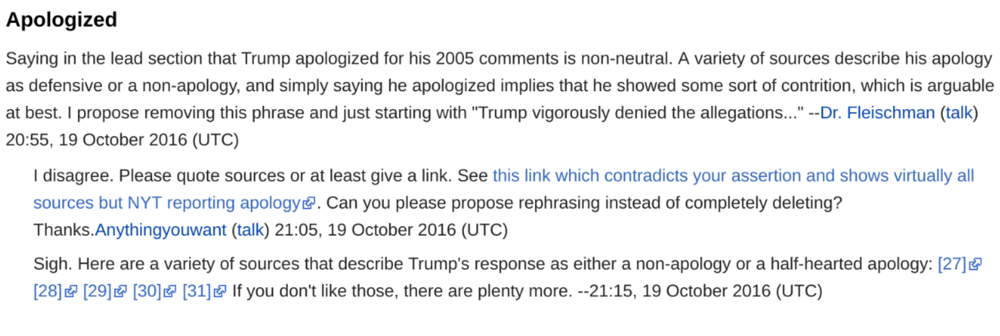

# Conversation Constructor for Wikipedia Talk Pages

This is a python2 package that contains reconstruction tools to extract the conversation structure
from Wikipedia talk pages.

You can find the Wikipedia [research
showcase](https://www.mediawiki.org/wiki/Wikimedia_Research/Showcase#June_2018) that explains the effort of
creating this dataset. The corresponding slides can be found
[here](slides/WikiConv\ --\ wikishowcase.pdf).

This reconstruction tool aims to show the wikipedia conversations with its full
history; namely also including not just new posts, but also modifications, 
deletions and reverts to them.
For example, rather than showing a snapshot of the conversation as in



The resulted the dataset includes all the actions led to it, as shown in

.

## Setup the environment

In the current directory

- Setup [your cloud project](https://cloud.google.com/dataflow/docs/quickstarts/quickstart-python)
- Setup [boto](https://cloud.google.com/storage/docs/boto-plugin#setup-python)
- Setup your python environment:
    - Please follow the guide in the first step to set up a virtualenv environment.
    - Do . /path/to/directory/bin/activate
    - pip install -r requirements.txt

## Run the pipeline
- Copy template.config to config/wikiconv.config using
```
rsync --ignore-existing ./template.config ./config/wikiconv.config
```
- Fill in your own configuration.
- Run run_pipeline.sh.
