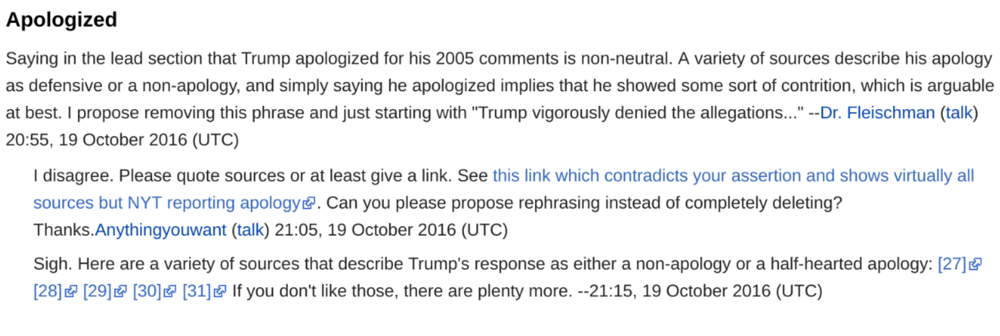

# WikiConv

WikiConv is a set of corpora encompassing conversations happens on Wikipedia.
The reconstruction process of this corpus has been published in EMNLP 2018
[WikiConv: A Corpus of the Complete Conversational History of a Large Online
Collaborative Community](paper/wikiconv-corpus-complete.pdf).
The second half of [this Wikipedia reasearch
showcase](https://www.mediawiki.org/wiki/Wikimedia_Research/Showcase#June_2018) presents the corpus and
the methodology.

WikiConv is a multi-language corpus, it currently includes:

- [English (20180701 data dump)](TBA)
- [Chinese (20180701 data dump)](TBA)
- [German (20180701 data dump)](TBA)
- [Greek (20180701 data dump)](TBA)
- [Russian (20180701 data dump)](TBA)

## Format of the reconstruction actions

Due to Wikipedia's format and editing style, conversations are just snapshots of
a history of edits (called revisions) that take place on a given Talk Page. We
parse these revisions, compute diffs, and separate the edits that were made into
a number of different kinds of 'actions':

*   `CREATION`: An edit that defines a new section in Wiki markup.
*   `ADDITION`: An edit that adds a new comment to the thread of a conversation.
*   `MODIFICATION`: An edit that modifies an existing comment on a Talk Page.
*   `DELETION`: An edit that removes a comment from a Talk Page.
*   `RESOTRATION`: An edit or revert that restores a previously removed comment.

## Schema

Each row of the table corresponds to an action as defined in the section above.
The schema for the table is then:

*   `id`: An id for the action that the row represents.
*   `conversation_id`: The id of the conversation in which the action took
    place. This is usually the id of the first action of the conversation.
*   `page_title`: The name of the Talk Page where the action occurred.
*   `indentation`: In Wiki markup, the level of indentation represents the
    reply-depth in the conversation tree.
*   `replyTo_id`: The id of the action that this action is a reply to.
*   `content`: The text of the comment or section underlying the action.
*   `cleaned_content`: The text of the comment or section underlying the action
    without MediaWiki formats.
*   `user_text`: The name of the user that made the edit from which the action
    was extracted.
*   `rev_id`: The Wikipedia revision id of the edit from which the action was
    extracted.
*   `type`: The type of action that the row represents. This will be one of the
    types enumerated in the previous section.
*   `user_id`: The Wikipedia id of the user making the edit from which the
    action was extracted.
*   `page_id`: The Wikipedia id of the page on which the action took place.
*   `timestamp`: The timestamp of the edit from which the action was extracted.
*   `parent_id`: For modification, removal, and restoration actions, this
    provides the id of the action that was modified, removed, or restored
    respectively.
*   `ancestor_id`: For modification, removal, and restoration actions, this
    provides the id of first creation of the action that was modified, removed,
    or restored respectively.

## Visualization of the English Dataset

You can play with our [visualization of the English
Dataset](http://conv-view.wikidetox-viz.appspot.com/). This data has been scored by the
[Perspective API](https://www.perspectiveapi.com/) so you can now browse the
comments by Toxicity. 
Click on the comment to see the whole conversation in which it occurs; click on
the link to be directed to the revision when this comment was posted.
You can also search comments by page or user.

*If you find a comment that contains personal information, please
contacting us at yiqing(dot)cs(dot)cornell(dot)edu and we will notify the Wikimedia Foundation, as well as remove it from this dataset.*

This system is still under development, any suggestions are welcome!


## Conversation Constructor for Wikipedia Talk Pages

This package contains reconstruction tools to extract the conversation structure
from Wikipedia talk pages.
Please note that this package used Python 2.7.

You can find the Wikipedia [Research
Showcase](https://www.mediawiki.org/wiki/Wikimedia_Research/Showcase#June_2018) that explains the effort of
creating this dataset. The corresponding slides can be found
[here](slides/WikiConv%20--%20wikishowcase.pdf).

This reconstruction tool aims to show Wikipedia conversations with their full
history; namely also including not just new posts, but also modifications, deletions and reverts to them.
For example, rather than showing a snapshot of the conversation as in



The resulting dataset includes all the actions led to it, as shown in

.

### Setup the environment

In the *current directory*:

- Follow the steps in section 1 to set up [your cloud project](https://cloud.google.com/dataflow/docs/quickstarts/quickstart-python). Note that *do not proceed* to install the newest google cloud dataflow, which may be in-compatible with some of the packages listed in requirements.txt.
- Use your service account to set up boto:
  `gsutil config -e`
- Setup your python environment:
    - Set up a [virtualenv environment](https://packaging.python.org/guides/installing-using-pip-and-virtualenv/)
    - Do . /path/to/directory/bin/activate
    - pip install -r requirements.txt

### Run the pipeline
- Copy template.config to config/wikiconv.config using
```
rsync --ignore-existing ./template.config ./config/wikiconv.config
```
- Fill in your own configuration.
- Run run_pipeline.sh.
