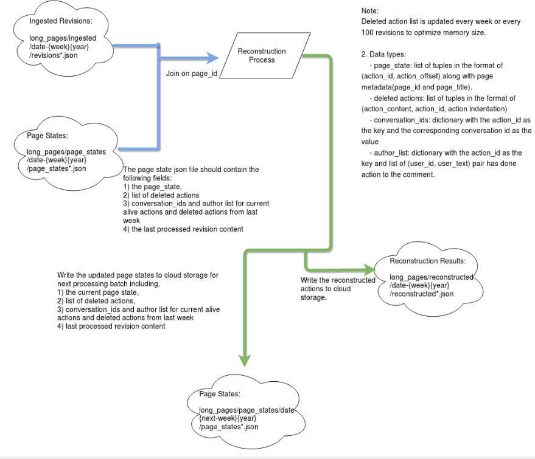
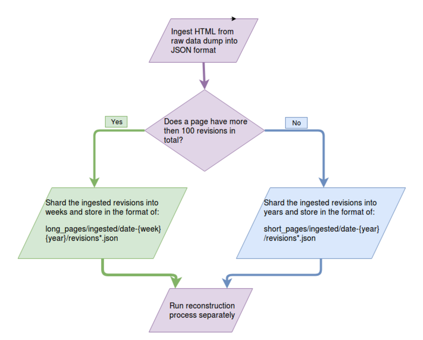

# Conversation Constructor for Wikipedia Talk Pages

This codebase is a dataflow pipeline for (re)constructing structured conversations from Wikipedia Talk Pages revisions.

Please consult the scripts in the `helper_shell` folder to run the pipeline with appropriate parameter settings.

The code will read from a join of the following two tables:
- A table with all revisions ingested in JSON format from a wikipedia data dump.
- A table with page states of previous reconstructed revisions.

The workflow can be seen in the following picture:

## Parameters for `dataflow_main.py`

  Flag | Description
  -----|------------
  `--category CATEGORY` | Specifies which kind of data is being processing (longer or shorter pages): valid arguments are: `long`, `short`, `test`.
  `--input CLOUD_STORAGE` | Specifies the cloud storage location(s) where the ingested avro files are stored.

  You can also select any arbitrary week (ranging from 1 to 53) in 2001 to 2017 to process, using parameters 'week' and 'year'. Revisions from the same page must be processed sequentially in temporal order. Thus make sure you've processed **all the data before week W from year Y**, stored all the page states and last processed revisions in cloud storage. The flags to process a specific week and year are:

  Flag | Description
  -----|------------
  `--week WEEK` | The week of data you want to process
  `--year YEAR` | The year that the week is in

### Sample Input

- [Ingested data dump sharded based on week](https://console.cloud.google.com/storage/browser/wikidetox-viz-dataflow/sharded_ingested_short_pages/?project=wikidetox-viz) This is generated using `shard.py` and the corresponding helper scripts. Please refer to the code for detailed information on data formats.

### Sample Output

- You can find your reconstructed results in the [cloud storage](https://console.cloud.google.com/storage/browser/wikidetox-viz-dataflow/reconstructed_res/?project=wikidetox-viz)
- The updated page states and last processed revisions will be updated to the corresponding folder in [process_tmp](https://console.cloud.google.com/storage/browser/wikidetox-viz-dataflow/process_tmp/?project=wikidetox-viz)

## The Approach to Efficient Reconstruction

The reconstruction job is parallelized by the page's size in terms of number of revisions. The reconstruction speed on each page largely depends on the number and total size of revisions for the pages. Since the distribution of number of revisions per page is not uniform, we divide pages into three categories for more efficient reconstruction because of the constraint on memory of dataflow jobs.

- Short pages: Pages with fewer than 100 revisions in total.
- Long pages: Pages with more than 100 revisions but fewer than 100,000 reivisions in total.
- Gigantic pages: Pages with more than 100,000 revisions in total, note that there are only two pages of this kind in our dataset (the talk page of the founder of Wikipedia, and the Main Page).

We suggest running the short pages in year by year (see recommended parameter settings in `helper_shell/reconstruct_short.sh`), long pages week by week (see recommended parameter settings in `helper_shell/reconstruct_long.sh`). For gigantic pages we process them individually and suggest running it with direct runner.

## Scripts to run different options

We provide two scripts for you to run on different data in helper_shell/.

- `reconstruct_short.sh`: This will process the relatively short pages, we suggest running with more weeks(~1 year) in one batch.
- `reconstruct_long.sh`: This will process the relatively longer pages, we suggest running with one week in one batch.

## Dataset structure

We record the following entries for each conversation action:
- `id`: The id of the action is the a string of three integers separated by ‘.’ representing: the id of the revision that the action was recorded, the offset of the starting position where the action  took place on the new page and the previous page.
- `content`: The content of the action, for actions with the type section creation, comment addition and modification, content is the updated text after the action. For comment removal and restoration actions, the content is the part of text being removed from and restored back to the page respectively.
- `type`: The type of the action from the six categories listed above.
- `parent_id`: The id of the parent action that contributed to the original content of the comment. Thus section creation and comment additions don’t have a parent. For modification, removal and restoration, the parent action is the action who added the original content that has been either modified, removed or restored on the page.
- `ancestor_id`: In contract to parent id, which records the direct parent action, this is the id of the original action from which all the derivations come from.
- `indentation`: Number of indentation symbols at the beginning of the content.
- `replyTo_id`: The id of the action that the current action is replying to, reply relation inferred using indentations.
- `conversation id`: Id of the conversation that the action belongs to,
- `user_id`: The id of the Wikipedian who did the action.
- `user_text`: The text of the Wikipedian’s username who did the action.
- `authors`: A list of pairs of id and username information from the Wikipedians who has changed the content of the action.
- `timestamp`: The timestamp of the action.
- `page_id`: Id of the page where the action took place
- `page_title`: Title of the page where the action took place.
- `rev_id`: Id of the revision when the action took place.
